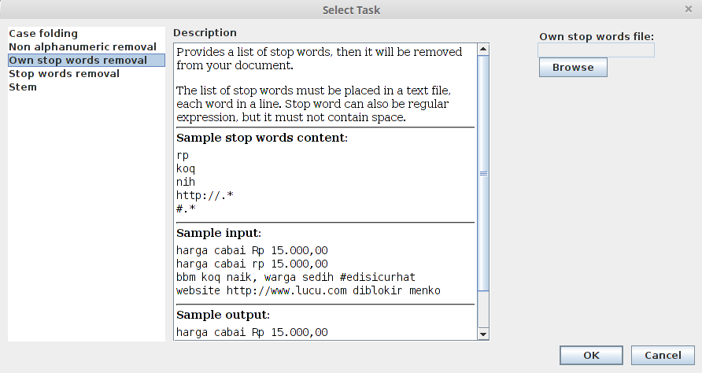

Basic Operation
===============

Overview
--------

Kemangi takes a plain text file, and process each line of the text as your command.

Plain Text File
  A text file that can be opened using basic text editor in your system (Windows: notepad, Linux: gedit, vi, etc).
  If it shows up cleanly, then it is a plain text file.

  Typical plain text file has .txt extension.

To do text preprocessing, you need to supply input file, list of tasks, and output target.

Here is a screenshot of a running Kemangi process to give a better understanding:

..  image:: assets/running-kemangi.png
    :scale: 75 %
    :align: center

Input File
----------

Simply by clicking "Browse" button.
Remember that the file must be a plain text. Kemangi can't process more complex extensions like .doc or .odt.

List of Tasks
-------------

You can add several tasks, and Kemangi will run the task in the given order.

To add a task, click "Add task". A window will appear and you can choose what kind of task to be added.

In general, there are three columns:

 * Left column shows a list of available task, click one to choose.
 * Middle column shows summary of chosen task.
 * Right column shows additional inputs required. You need to supply these inputs if any is required.

To remove a task, click on that task in the list, then click "Remove task".

To move a task's order, click on that task in the list, then click "Move up" or "Move down".

Some tasks may need additional inputs. For example, own stop words removal demands text file containing list of stop words provided by you.

Some tasks may also includes another tasks. For example, stop words removal already includes case folding.

Output Target
-------------

Simply by clicking "Browse" button.
Then proceed as if you are going to save a file as usual.

Start Processing
----------------
Click the "Start" button and text processing will start.

When unexpected error occurs (required internet, but your connection is lost), Kemangi will print the latest preprocessed text ``intermediateResult.bak`` in Kemangi's directory.
It is a plain text file, and you can open it with any basic text editor.

Kemangi also logs its activity in ``kemangi.log``. Log is useful to analyze what is going on when error happens.
