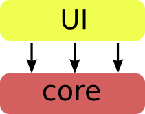
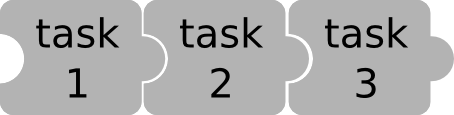

Developer Guide
===============

This section describes Kemangi's architecture for developer who might be interested to contribute.

Tools
-----
Kemangi uses `Maven <https://maven.apache.org/>`_: Apache build manager for Java projects.
By using Maven, dependencies, unit tests, and build options are configured under pom.xml.

Package Structure
-----------------

Kemangi is mainly divided into two chunks: core and UI.

Core package basically does the work, while UI acts like an adaptor between user and core package.
With this structure, core and UI may evolve independently.

Another adaptor can also built on top of core modules, e.g. for Kemangi's support as command line tool.

Task Architecture
-----------------

Each kind of task must implement interface ``Task``.
Task needs to have the capability to take a list of string tokens, do the job, and return a list of processed string tokens.

By using this architecture, tasks can be chained like a pipeline.
User can easily customize what kind of task to be done and in what order.

Future Development
------------------

Check `Kemangi's repository <https://github.com/gyosh/kemangi/issues>`_ for issues and development plan.
If you have any comment or suggestion, feel free to drop issues!
